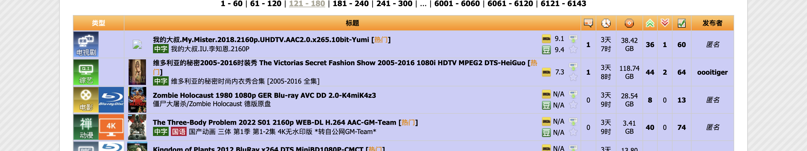
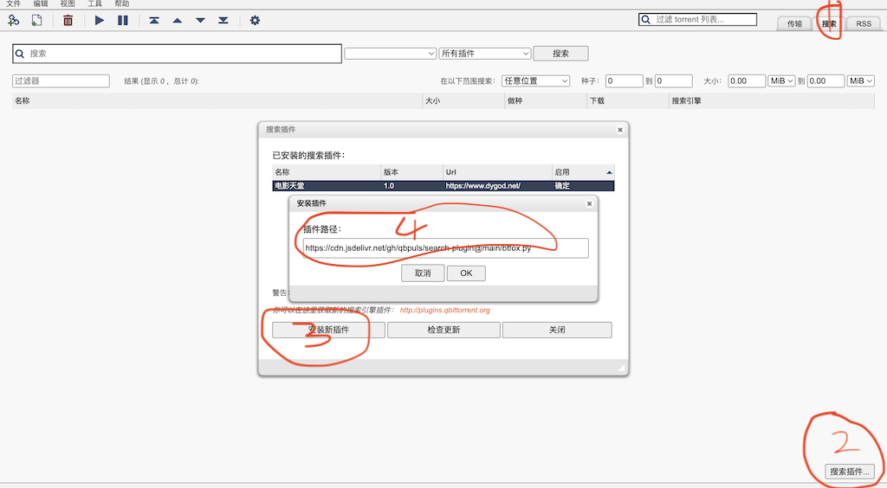

# search-plugin
qb search plugin

## 环境依赖

- python3

### python 库
- requests
- lxml


## 加速访问文件方式

<style>
    [alt=icon]{
        width:25px;
        vertical-align:middle;
    }
</style>

|| 官网 | 文件名字 | 加速地址 |
|---| ---- | ------ | -------- |
|| [磁力狐](https://mk.btfox.pw/) | btfox.py | https://cdn.jsdelivr.net/gh/qbpuls/search-plugin@main/btfox.py
|| [电影天堂](https://www.dygod.net/) | ygdy8.py | https://cdn.jsdelivr.net/gh/qbpuls/search-plugin@main/ygdy8.py
|| [4k蓝光原盘](https://www.yinfans.me/) | yinfans.py | https://cdn.jsdelivr.net/gh/qbpuls/search-plugin@main/yinfans.py
|| [d2mp4](https://www.d2mp4.net/) | d2mp4.py | https://cdn.jsdelivr.net/gh/qbpuls/search-plugin@main/d2mp4.py
|| [磁力电影天堂](https://www.clmp4.com/) | clmp4.py | https://cdn.jsdelivr.net/gh/qbpuls/search-plugin@main/clmp4.py

欢迎提交PR或者提供更多稳定网址地址.

## nexus 框架网站

网页布局如下

插件效果


这部分操作相对复杂, 需要获取网站cookie, passkey 等,所以写了个nexus用于生成对应网站的脚本.
`nexus.py` 同目录下需要一个`nexus.json`文件
文件内容如下
```json
{
    "脚本名字":{
        "name":"网站名字",
        "url":"网站地址",
        "cookie":"cookie, 用于搜索时使用"
        "passkey": "网页[ 控制面板 ] 密钥的值,用于下载种子时使用"
    }
    ...
}
```
注意: 脚本名字最好是域名, 不要有奇怪的符号.

运行`python nexus.py` 则会在`nexus.py` 同路径下生成相关脚本,将其复制到插件目录,重启或者一一安装即可.

## 插件安装过程




## 常见问题

1. 安装确定后,没有查到相关插件, 刷新等待, 或者重启, 重启会加载所有插件目录的插件出来.
2. 网页链安装,插件安装失败. 可以尝试将插件脚本单独复制进去, 然后手动安装(输入插件路径)或者重启.
3. 插件响应慢, 插件慢有多种因素, 一个是对方网站本身延迟高, 或者数据涉及页面较深.